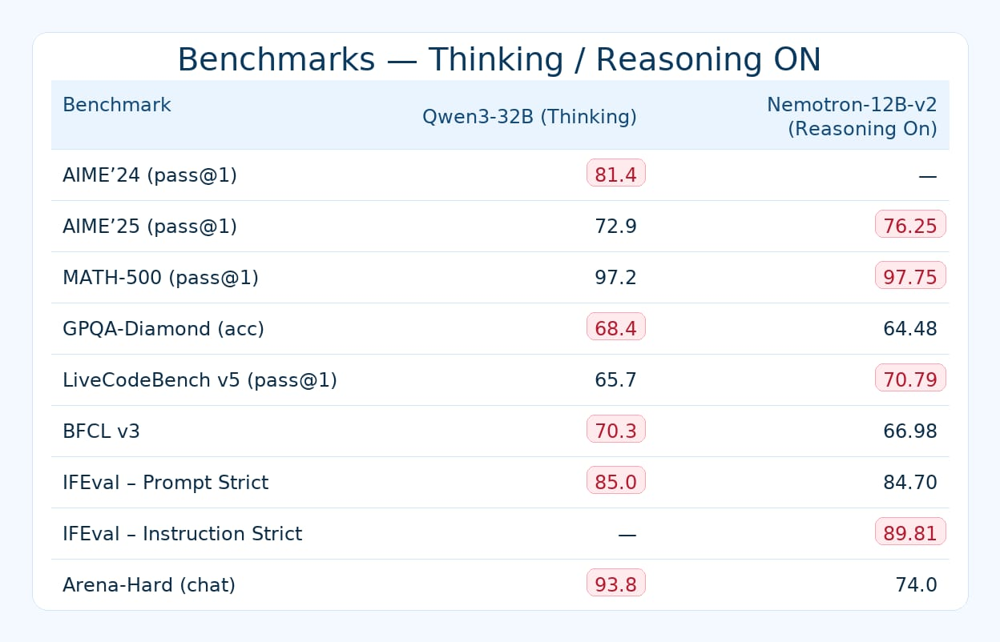

# nemotron_vllm_autoconfig

> Production-ready vLLM “just works” setup for **NVIDIA Nemotron‑Nano‑12B‑v2** on **Ubuntu 24.04 LTS + RTX 5090** — tuned for my personal server and exact hardware.  
> Repo link: https://github.com/BigBIueWhale/personal_server

---

🔴🔴🔴

# ⚠️ **MODEL QUALITY DISCLAIMER**

**NVIDIA‑Nemotron‑Nano‑12B‑v2 performs poorly at coding tasks.** For context, even the **older *****Mistral Codestral‑22B (original, May 2024)***—practically *ancient* in LLM terms—still beats Nemotron at code. **This is an example comparison, not a recommendation to use Codestral.**

This repo exists to demonstrate a vLLM server configuration for Nemotron, **not** to recommend it for code work. If you care about code quality, choose a different model that fits your needs.

🔴🔴🔴

---

## What this is

This project pins **server‑side defaults** for vLLM so that **OpenWebUI** (or any OpenAI‑compatible client) doesn’t have to pass a dozen sampling knobs. It’s built for **my specific machine**:
- **GPU:** RTX 5090 (Blackwell, sm_120)
- **Driver:** 580.xx (open)  
- **CUDA:** 13.0
- **OS:** Ubuntu 24.04 LTS

With this exact combo, **Nemotron‑Nano‑12B‑v2** runs **in full precision (no quantization)** and stays stable. We intentionally use **vLLM** (not Ollama here) because vLLM lets us hard‑code *all* decoding defaults on the server.

> ⚠️ **Why custom config is needed (philosophy):** Pretty much all models **require very specific runtime flags** to behave correctly. For Nemotron v2, using the wrong defaults can make the model **quietly underperform (“silently stupid”)** without obvious errors. This repo bakes in the correct settings — notably `mamba-ssm-cache-dtype: float32` — plus conservative decoding defaults. Clients can still tweak a couple of knobs (e.g., `temperature`), but the server remains the single source of truth for everything else.

---

## Contents

- **[`config.yaml`](./config.yaml)** — vLLM server config. Sets the model, networking, Nemotron‑specific flags, and **complete** default decoding parameters (temperature/top‑p/top‑k/penalties/max_tokens, etc.). Clients inherit these unless they explicitly override a field.
- **[`run_vllm.sh`](./run_vllm.sh)** — one‑shot “install” script that pulls the NVIDIA vLLM container and creates a persistent Docker container named `nemotron_vllm` with `--restart unless-stopped`. Run it once; use `docker start nemotron_vllm` on reboots.
- **[`OPENWEBUI_SETUP.md`](./OPENWEBUI_SETUP.md)** — step‑by‑step wiring for OpenWebUI (OpenAI‑compatible backend), written in the same style as my earlier notes.
- **[`UNINSTALL.md`](./UNINSTALL.md)** — how to stop/remove the container and (optionally) delete the Docker image and HF cache.



---

## Quick start

1. **Optional:** export your HF token (for first‑time download from Hugging Face):
   ```bash
   export HF_TOKEN=hf_************************
   ```

2. **Install / create the server container** (one time):
   ```bash
   chmod +x ./run_vllm.sh
   ./run_vllm.sh
   ```

3. **Test the endpoint:**
   ```bash
   # From the host:
   curl -s http://172.17.0.1:8000/v1/models | jq .
   ```

4. **Hook up OpenWebUI:** see **[OPENWEBUI_SETUP.md](./OPENWEBUI_SETUP.md)**.

---

## Why these settings?

* **Nemotron‑specific requirement:** `mamba-ssm-cache-dtype: float32` dramatically affects quality on Nemotron‑Nano‑12B‑v2. This is enforced in `config.yaml` so you can’t forget it.
* **Large context with realistic concurrency:** The config sets `max-model-len: 131072` (≈128K tokens) and **`max-num-seqs: 1`**. With 12B params on an RTX 5090 and full‑precision weights, this leaves ~4–5 GiB for KV cache at startup, which practically limits safe concurrency to ~1 request at 128K context.
* **Decoding defaults:** We pin **temperature 0.6 / top_p 0.95 / top_k 50**, with neutral repetition/presence/frequency penalties and a generous `max_new_tokens` default (131072). Clients can override per‑request; the server supplies sensible fallback behavior.
* The containerized vLLM server listens on `0.0.0.0:8000` **inside the container**, and the Docker publish in `run_vllm.sh` maps it to **`172.17.0.1:8000` on the host** (the Docker bridge gateway). This keeps the API reachable to containers (e.g., OpenWebUI via `host.docker.internal`) while not exposing it on your host’s primary interfaces. If you ever need LAN exposure, change `BIND` to `0.0.0.0` (see `OPENWEBUI_SETUP.md`).

### Notes about the NVIDIA vLLM image

* **Flash‑Attention backend** is used automatically on Blackwell; no extra flags required.
* **Mamba engine log line:** You’ll see a log like “Mamba is experimental on VLLM_USE_V1=1. Falling back to V0 Engine.” That’s expected with this image/version and fine for Nemotron‑v2.
* **Chunked prefill:** vLLM auto‑enables it for contexts larger than 32K and will warn that it “might not work with some features/models.” Leave it on unless you observe issues; then relaunch with `--enable-chunked-prefill=False`.

---

## Compatibility notes

- Uses **NVIDIA vLLM container** (`nvcr.io/nvidia/vllm:25.09-py3`) built for **CUDA 13** and **Blackwell** (RTX 50‑series). No wheel rebuilds, no mismatched compute capability issues.
- Assumes you already installed the **NVIDIA Container Toolkit** and your driver exposes the GPU inside containers via `--gpus all`.

---

## Operating the server (start / stop / pause)

### Check status

```bash
docker ps
curl -s http://172.17.0.1:8000/v1/models | jq .
docker logs -f nemotron_vllm
```

### Stop (frees VRAM)

> Use **stop** to fully release GPU memory.

```bash
docker stop nemotron_vllm
```

Verify with:

```bash
nvidia-smi
```

### Start (loads model and uses VRAM again)

```bash
docker start -a nemotron_vllm   # attach logs
# or
docker start nemotron_vllm
```

### Restart

```bash
docker restart nemotron_vllm
```

### Pause vs Stop

* `docker pause` **does not free VRAM** (the process is frozen but GPU memory stays allocated).
* `docker stop` **does free VRAM** (the process exits and releases the GPU).

```bash
docker pause nemotron_vllm
docker unpause nemotron_vllm
```

### Auto-restart policy

The container is created with `--restart unless-stopped`.

* Disable auto-restart:

```bash
docker update --restart=no nemotron_vllm
```

* Re-enable:

```bash
docker update --restart=unless-stopped nemotron_vllm
```

### Remove and recreate (if you want a clean slate)

```bash
docker stop nemotron_vllm || true
docker rm nemotron_vllm || true
./run_vllm.sh
```

## License

This repo contains only configuration and scripts I wrote for my own server layout. Model weights are **not** distributed here; they are fetched from Hugging Face under their license terms.
